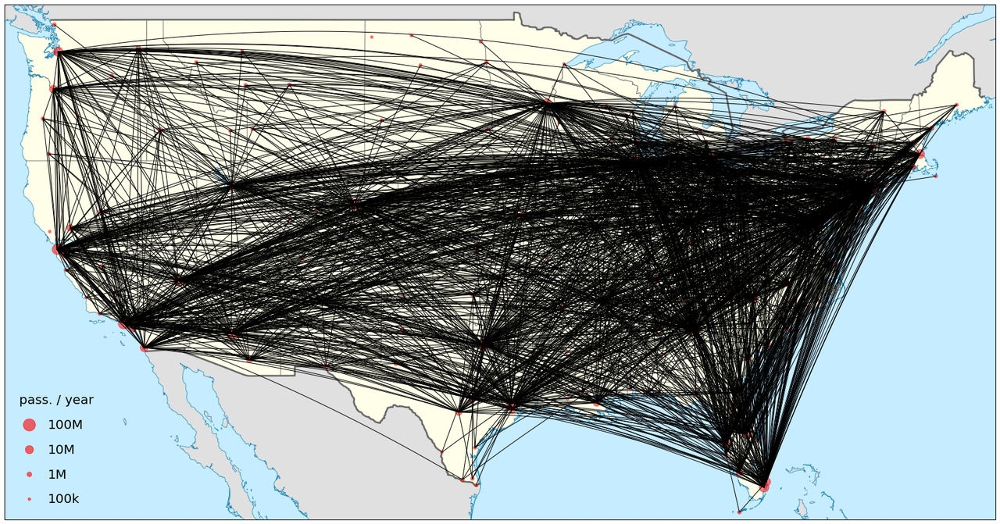
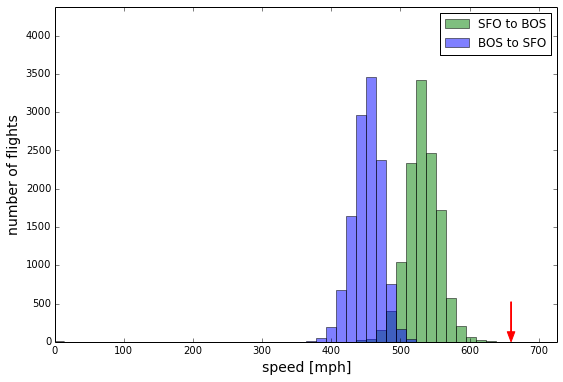
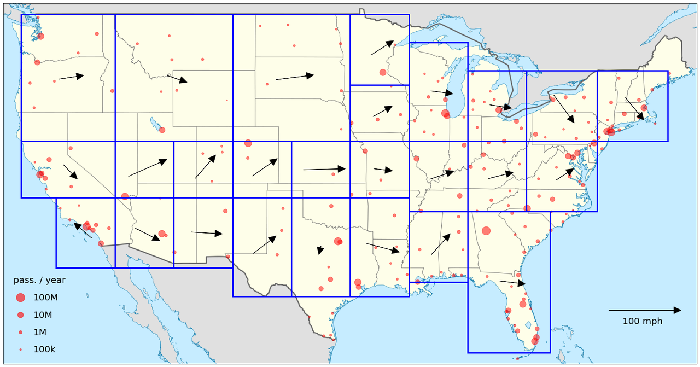
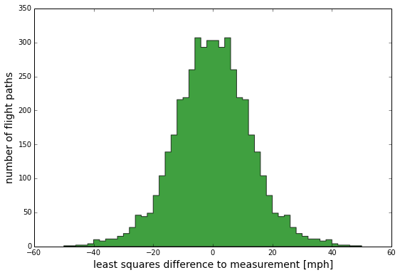
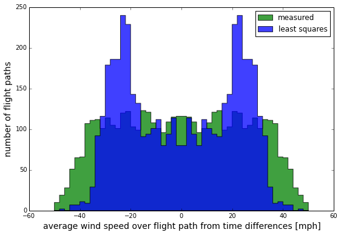

w<!--
.. title: Measuring Wind Speeds from Flights
.. slug: measuring-wind-speeds-from-flights
.. date: 2015-08-12 01:14:53 UTC-07:00
.. tags: mathjax, flights, data science, SQL, python, ipynb, linear algebra
.. category:
.. link:
.. description:
.. type: text
-->

If you've ever flown between the East coast and West coast, you know the feeling: going west takes soooo much longer!  The difference in flight times is about an hour, which can be painful if it's tacked onto the end of a long trip.

Let's run some basic numbers.  Suppose we between SFO and BOS on a 737, which has a cruising speed of $v_{\rm cruise} \sim 500$ mph.  It's $d \sim 2700$ miles between the two cities, so with no wind the flight time would be $t_{\rm flight} = $ 5 hours and 24 minutes.  If it takes $\Delta t = 1$ hour longer for the eastward trip, then the average jet stream velocity, $\bar{v}$, is given by the relation

$$
\begin{align}
&\frac{d}{v_{\rm cruise} - \bar{v}} - \frac{d}{v_{\rm cruise} + \bar{v}} = \Delta t \\\
& \qquad \Rightarrow \; \bar{v} = \frac{d}{\Delta t} \Biggl( \sqrt{1 + \frac{\Delta t^2 v_{\rm cruise}^2}{d^2} } - 1 \Biggr) \approx \frac{v_{\rm cruise} \Delta t}{2d} \, v_{\rm cruise} = \frac{\frac12 \Delta t}{t_{\rm flight}} v_{\rm cruise},
\end{align}
$$

so that in this case $\bar{v} \approx 46 \text{ mph}$.  This is the average jet stream velocity over the flight path (as experienced by the flight), but what if we want to get finer grained than this?  Can we use this basic idea to build a map of the jet stream across the US?

It turns out, the answer is yes!  And we can do so via a nice linear algebra problem, mixed in with some spherical geometry.  Here's how it goes.

<!-- TEASER_END -->

# <span style="color:blue">The Data</span>

I started to think about this project when I ran across a nice, big publicly available data set on flights within the American Statistical Association, from a [2009 data expo](http://stat-computing.org/dataexpo/2009/ "2009 ASA data expo"), here.  There are 120 million flight records spread over nearly 21 years, and the data is pretty clean.  We'll use 5 years of the data here, from 2004-2008, which has more than 32 million flights (plus about 4 million we drop when we clean the data).  Each flight record contains the following information:

   * date
   * departure and arrival times, both scheduled and actual
   * carrier code, flight number, plane's tail number
   * origin and destination, distance between airports
   * flight times: elapsed time (actual and scheduled), taxi time in/out, time in the air
   * delays: arrival and departure delays, delays in categories (carrier, weather, NAS, security, late   aircraft)
   * flags for whether the flight was cancelled (and why), or diverted

Which is a lot of info!  They even provide accompanying data sets on airports, carriers, and planes.  The data comes in .csv files by year, so it's easy to drop into a MySQL database.

Relevant to our question, what does the data let us do?  We can compute the average velocity for each flight, using the air time and distance traveled.  The airport dataset also has handy latitude and longitude coordinates, so we can figure out the idealized path the plane travels (on a great circle).

What doesn't this data set contain?  The most important missing item is the actual flight path.  If this deviates far from a great circle, the velocity of the flight may be very different from what is reported (and the path the flight travels will be different).  This is a feature we'll have to deal with, and maybe with another data set, such as one from a flight tracking site, we could build a more precise model.  But this data set is a great example of what you can do with less-than-complete information, so let's build a model!

Here's a map of every airport with more than 100,000 enplanements per year (using recent passenger data), with a few example flight paths: San Francisco to Boston, Seattle to Miami, and Dallas-Fort Worth to Chicago.

<br>
<div style="text-align: center;"></div>
<br>

There are 203 airports on the map, and the smaller ones are needed to give reasonable coverage of the High Plains and eastern Northwest.  Here are all flight paths between pairs of airports with more than 100 flights in each direction in the 5-year time range of the data.  Of the <span style="color:red">20503</span> possible airport pairs (pairs drawn from the 203 airports), there are <span style="color:red">2334</span> that meet this criterion.

<br>
<div style="text-align: center;"></div>
<br>

# <span style="color:blue">The Model</span>

First, let's discuss flights between a pair of cities $i$ and $j$; we'll label this route as path $p$.  Since we're assuming all flights on $p$ follow the same great circle, we can take the average speed of flights from $i$ to $j$, ${\bar v}^{(ij)}\_{\text{flight}}$, and the average speed of flights from $j$ to $i$, $\bar{v}^{(ji)}_{\rm flight}$.  The jet stream parallel to the flight path (averaged over the flight path) is given by

<div> $$
\begin{align}
{\bar v}^{(p)} = \frac12 ( \bar{v}^{(ij)}_{\rm flight} - \bar{v}^{(ji)}_{\rm flight}).
\end{align}
$$ </div>

We can write this distance-averaged speed in terms of the jet stream velocity $\vec{v}$ as a line integral over the path $C_p$ of the flight:

$$
\bar{v}^{(p)} = \frac{1}{d_p} \int_{C_p} d\vec{s} \cdot \vec{v} (s),
$$

where $d_p$ is the distance between the cities.  We can discretize the integral by dividing the US up into patches over which we approximate the jet stream as having a constant direction; then we have

$$
\bar{v}^{(p)} = \frac{1}{d_p} \sum_k \vec{r}_k^{(p)} \cdot \vec{v}_k,
$$

where the sum is over patches and $\vec{r}_k^{(p)}$ is the distance vector of the path in patch $k$.

Here's a map of (26) boxes in the US we'll use; we'll have a speed measurement in each box.  In the eastern US, which has denser flight patterns, we can use smaller boxes and get good enough coverage.

<br>
<div style="text-align: center;"></div>
<br>

In terms of latitude and longitude directions (which are just $\hat{\phi}$ and $\hat{\theta}$ in spherical coordinates),

<div> $$
\frac{1}{d_p} \vec{r}_k^{(p)} \cdot \vec{v}_k = \dfrac{1}{d_p} \bigl( r_{k,\theta}^{(p)} v_{k,\theta} + r_{k,\phi}^{(p)} v_{k,\phi} \bigr).
$$ </div>

For any flight path, we can measure $\vec{r}\_k^{(p)}$ and $d_p$, meaning that we can access the unknowns $v_{k,\theta}$ and $v_{k,\phi}$.

So now we have the dependence on the jet stream in patches of sky for one flight path -- great!  How do we turn this into a system where we can solve for the jet stream velocity?  We use a whole bunch of flight paths!  Using our data set, we can take a large collection of cities, and look at flights between pairs.  Let's be concrete and label them $1, \ldots, N_p$, and label the number of patches $1, \ldots, N_b$.

For each path, we get an equation like the above, where we can express the average jet stream speed along that path (which we can measure from the average velocities) in terms of the components of jet stream velocities in each patch.  This forms a linear system, which is overcomplete as you might expect because we can easily have many more pairs of cities (flight paths) than patches of sky.

The linear system can be written

$$
\mathbf{M} \, V = \bar{V},
$$

where

$$
\mathbf{M} = \left( \begin{matrix}
   r_{1,\theta}^{(1)} / d_1 & r_{1,\phi}^{(1)} / d_1 &  r_{2,\theta}^{(1)} / d_1 & r_{2,\phi}^{(1)} / d_1 & \ldots \\\
   r_{1,\theta}^{(2)} / d_2 & r_{1,\phi}^{(2)} / d_2 &  r_{2,\theta}^{(2)} / d_2 & r_{2,\phi}^{(2)} / d_2 & \ldots \\\
   \vdots & \vdots & \vdots & \vdots &
\end{matrix} \right),
$$

$$
V = \left( \begin{matrix}
   v_{1,\theta} \\\
   v_{1,\phi} \\\
   v_{2,\theta} \\\
   v_{2,\phi} \\\
   \vdots
\end{matrix} \right) ,
\quad \bar{V} = \left( \begin{matrix}
   \bar{v}^{(1)} \\\
   \bar{v}^{(2)} \\\
   \vdots
\end{matrix} \right) .
$$

The matrix $\mathbf{M}$ is $N_p \times 2N_b$, with $N_p$ the larger dimension (so that the flight paths provide good coverage to the different regions of the map).  This means that the system is overconstrained.  A simple approach, then, is to use least squares minimization, which is the minimization condition

$$
\min_{V} \, \lvert \lvert \mathbf{M} V - \bar{V} \rvert \rvert,
$$

and has a solution

$$
V = \bigl( \mathbf{M}^{\rm T} \mathbf{M} \bigr)^{-1} \mathbf{M}^{\rm T} \bar{V}.
$$

This is great!  We have a way to measure the jet stream from the data set we have, since we can construct $\mathbf{M}$ and $\bar{V}$ using the flight information and the geometry of the cities we'll use in the data set.

Before we start looking at the data, let's briefly talk about the assumptions inherent in the model.  In calculating $\vec{\bar{v}}_{\rm jet}^{(ij)}$ by the simple difference, we have assumed that flights in both directions have the same fraction of types of planes -- certain models of planes are faster or slower than others, and faster planes go more often from $i$ to $j$ than $j$ to $i$, this will throw off the measurement of the average jet stream velocity.  This is a good assumption given that on many routes planes hop back and forth between cities.

Another assumption we've made, given what is in the data set, is that each flight follows a great circle.  While this is the shortest path, planes will sometimes deviate from a great circle to avoid bad weather or optimize the wind assist from the jet stream.  This is particularly true of flights over the Atlantic, where east and west bound flights often fly at very different latitudes (in the US, this seems to happen much less often).  However, time is money, and so deviations from the shortest path are usually minimal.  Scanning through flight paths online, most seem to travel a path whose distance is within a few percent of the shortest.  From the structure of the model, if we had flight path information for individual flights, we could input this into the model and gain more fine-grained sensitivity to the jet stream.

Now let's look at the data and do the measurement!

### <span style="color:blue">Setting Up a Database</span>

The data is fairly easy to work with, but it's useful to look at the analysis pipeline.  The data come in `.csv` format divided by year; here's the first few lines for 2008:

<br>
```
Year,Month,DayofMonth,DayOfWeek,DepTime,CRSDepTime,ArrTime,CRSArrTime,UniqueCarrier,FlightNum,TailNum,ActualElapsedTime,CRSElapsedTime,AirTime,ArrDelay,DepDelay,Origin,Dest,Distance,TaxiIn,TaxiOut,Cancelled,CancellationCode,Diverted,CarrierDelay,WeatherDelay,NASDelay,SecurityDelay,LateAircraftDelay
2008,1,3,4,2003,1955,2211,2225,WN,335,N712SW,128,150,116,-14,8,IAD,TPA,810,4,8,0,,0,NA,NA,NA,NA,NA
2008,1,3,4,754,735,1002,1000,WN,3231,N772SW,128,145,113,2,19,IAD,TPA,810,5,10,0,,0,NA,NA,NA,NA,NA
2008,1,3,4,628,620,804,750,WN,448,N428WN,96,90,76,14,8,IND,BWI,515,3,17,0,,0,NA,NA,NA,NA,NA
2008,1,3,4,926,930,1054,1100,WN,1746,N612SW,88,90,78,-6,-4,IND,BWI,515,3,7,0,,0,NA,NA,NA,NA,NA
```
<br>

Similar files exist for holding data for airports, carriers, and planes.  The database is that complete -- you can see the routes that a given plane (tagged by its tail number) flies!

Let's set up a `MySQL` database for this data.  First we create the database and start using it:

<br>
```mysql
CREATE DATABASE flight_data;
USE flight_data;
```
<br>

Then we create tables for each of our 4 categories.  For the flight data, which is the most complex by far, the syntax is

<br>
```mysql
CREATE TABLE flights (Year INT, Month INT, DayofMonth INT, DayofWeek INT, DepTime INT, CRSDepTime INT, ArrTime INT, CRSArrTime INT, UniqueCarrier VARCHAR(5), FlightNum INT, TailNum VARCHAR(8), ActualElapsedTime INT, CRSElapsedTime INT, AirTime INT, ArrDelay INT, DepDelay INT, Origin VARCHAR(3), Dest VARCHAR(3), Distance INT, TaxiIn INT, TaxiOut INT, Cancelled INT, CancellationCode VARCHAR(1), Diverted VARCHAR(1), CarrierDelay INT, WeatherDelay INT, NASDelay INT, SecurityDelay INT, LateAircraftDelay INT);
```
<br>

And to fill it we can load directly from the `.csv` files (after removing the header).  For the 2008 year,

<br>
```mysql
LOAD DATA LOCAL INFILE "/Users/.../2008.csv" INTO TABLE flights FIELDS TERMINATED BY ',' LINES TERMINATED BY '\n';
```
<br>

It's that easy!  The same process works for the remaining flight data, as well as the other categories.

### <span style="color:blue">Working with the data</span>

This kind of project is great for `python`, especially with `ipython notebook` and `matplotlib` to allow easy exploration of the data.  Since the model involves some linear algebra, `numpy` is a necessity (`pandas` would also be useful, although I didn't use it here).

To read in the data, I use the `pymysql` module to interact with `MySQL`.  A simple function can call the `flight_data` database with an input query:

<br>
```python
## function to query the database
def sqlExec(query):
    """Given file name, reads input file and stores data"""
    db = pymysql.connect(user="root", host="localhost", passwd="", db="flight_data", cursorclass=pymysql.cursors.DictCursor)
    with db:
        cur = db.cursor()
        cur.execute(query)
        tables = cur.fetchall()
        return tables
```
<br>

In our case, we want to pull down flights that are not cancelled or diverted.  Looking through the data, JetBlue flights appear to frequently have problems with the flight time not accounting for the change in time zone, which leads to an incorrect speed measurement.  So, we don't take JetBlue flights.  If we lost a lot of data because of this we could try to fix the flight records, but the data set is more than enough when we play it safe and drop JetBlue's records.

<br>
```python
## pull flights from the database
## Jet Blue flights (UniqueCarrier = 'B6') often have the wrong time zone for the origin or destination, so we drop this data
flights = sqlExec("SELECT Origin,Dest,Distance,AirTime FROM flights WHERE Origin IN "+sqlsetairports+" AND Dest IN "+sqlsetairports+" AND Cancelled = 0 AND Diverted = 0 AND UniqueCarrier != \"B6\"")
print "Total of "+str(len(flights))+" flights"
```
<br>

`sqlsetairports` is a long list of the 203 airports we are using, pulled from the airports database.  Running this query on our database returns just over 32 million flight records.

From here, we need to measure the speed of each flight between each pair of cities, then average for each flight route.  First we create a dictionary, `speeds`, whose key will be a pair of cities (a string representing the pair), and whose value is a list of speeds for all flights in that route:

<br>
```python
for flight in flights:
    A = flight["Origin"]
    B = flight["Dest"]
    dist = flight["Distance"] # distance is in miles
    time = flight["AirTime"]/60 # convert time to hours
    # check the time is nonzero
    if time > 0:
        speed = dist / time
        speeds[airportpair_key(A,B)].append(speed)
```
<br>

We've define a simple function here to take in strings for each airport (e.g., "SFO") and output a combined string to represent the pair; just a little syntatic sugar.  Next we average:

<br>
```python
## calculate the mean windspeed between airport pairs
vbarspeeds = []
for i in range(len(airports)):
    for j in range(i+1,len(airports)):
        A = airports[i]
        B = airports[j]
        # only allow city pairs with more than 100 flights each way
        if len(speeds[airportpair_key(A,B)]) > 100 and len(speeds[airportpair_key(B,A)]) > 100:
            AtoBspeed = np.mean(speeds[airportpair_key(A,B)])
            BtoAspeed = np.mean(speeds[airportpair_key(B,A)])
            vbar = 0.5 * (AtoBspeed - BtoAspeed)
            # keep things symmetrized: we include the A -> B and B -> A paths
            # this does not affect the least squares but does make comparisons easier
            vbarspeeds.append([A, B, vbar])
            vbarspeeds.append([B, A, -vbar])
```
<br>

This gives us the average wind speed $\bar{v}^{(p)}$ for each flight path.  The technically challenging part of the model is to take each flight path and construct the relevant entries in $\mathbf{M}$, which contain the oriented path of the flight in each box.  We can accomplish this using a nice parameterization of a great circle in terms of latitude and longitude (which are the coordinates we draw our boxes in):

<br>
```python
## parametric function for a great circle between two longitude, latitude points
def greatCircleFunc(coords1, coords2, t):
    """Gives parametric formula for the great circle between two latitude, longitude points. Returns [latitude, longitude] in degrees."""
    [long1, lat1] = coords1
    [long2, lat2] = coords2
    ## convert latitudes to polar angles (radians)
    theta1 = 0.5 * np.pi - (np.pi / 180.) * lat1
    theta2 = 0.5 * np.pi - (np.pi / 180.) * lat2
    ## convert longitudes radians
    phi1 = (np.pi / 180.) * long1
    phi2 = (np.pi / 180.) * long2
    ## create unit vectors to each point
    unitvec1 = np.array([ np.sin(theta1) * np.cos(phi1), np.sin(theta1) * np.sin(phi1), np.cos(theta1) ])
    unitvec2 = np.array([ np.sin(theta2) * np.cos(phi2), np.sin(theta2) * np.sin(phi2), np.cos(theta2) ])
    ## angle between the two points
    tau = np.arccos( np.dot(unitvec1, unitvec2) )
    ## parametric terms
    A = np.sin((1 - t)*tau) / np.sin(tau)
    B = np.sin(t*tau) / np.sin(tau)
    ## compute latitude, longitude
    xt = A * np.sin(theta1) * np.cos(phi1) + B * np.sin(theta2) * np.cos(phi2)
    yt = A * np.sin(theta1) * np.sin(phi1) + B * np.sin(theta2) * np.sin(phi2)
    zt = A * np.cos(theta1) + B * np.cos(theta2)
    longt = (180. / np.pi) * np.arctan2(yt, xt)
    latt = (180. / np.pi) * np.arctan2(zt, np.sqrt(xt*xt + yt*yt))

    return [longt, latt]

 ## compute box fractions and path directions in latitude-longitude space
 def boxfractions(coords1, coords2, boxes):
     """Computes the fraction of total distance of a geodesic path in a given latitude-longitude box.  Returns the distance fractions in the path for each box."""
     [long1, lat1] = coords1
     [long2, lat2] = coords2
     ## counter for each box
     boxpts = [0 for n in range(len(boxes))]
     ## loop over steps in t, use parametric function of geodesic path
     nsteps = 99
     for nstep in range(nsteps+1):
         ## get t value and latitude, longitude
         tval = nstep * 1. / nsteps
         [longt, latt] = greatCircleFunc(coords1, coords2, tval)
         ## loop over boxes
         for nbox in range(len(boxes)):
             ## check if our point is in the box
             if boxes[nbox][0][0] < longt < boxes[nbox][0][1] and boxes[nbox][1][0] < latt < boxes[nbox][1][1]:
                 boxpts[nbox] += 1./(nsteps+1)
     return boxpts
```
<br>

The second function will compute the fraction of the great circle path between two coordinates in a given set of latitude-longitude boxes.  To construct $\mathbf{M}$, we apply this function to each path:

<br>
```python
## construct M
## for each path, we record the longitude then latitude components
rows = []
for path in vbarspeeds:
    [long1, lat1] = airportcoords[path[0]]
    [long2, lat2] = airportcoords[path[1]]
    boxfracs = boxfractions(airportcoords[path[0]], airportcoords[path[1]], boxes)
    ## here we approximate the direction of travel in each box as a straight line in latitude-longitude space
    ## this is a reasonable approximation for the direction
    rhatlat = (lat2 - lat1) / np.sqrt((lat2 - lat1)*(lat2 - lat1) + (long2 - long1)*(long2 - long1))
    rhatlong = (long2 - long1) / np.sqrt((lat2 - lat1)*(lat2 - lat1) + (long2 - long1)*(long2 - long1))
    row = []
    for frac in boxfracs:
        row.append(rhatlong * frac)
        row.append(rhatlat * frac)
    rows.append(row)
M = np.matrix(rows)
```
<br>

Note that we're assuming the great circle path is straight, along the mean great circle path, in each box.  Since the total area of the US is small enough so that the flight paths are fairly straight, this is a reasonable approximation.

Finally, we've just got to do the basic linear algebra to get the wind velocities.

<br>
```python
## now find vJ
Mlsm = np.array(np.dot(np.linalg.inv(np.dot(np.transpose(M), M)),np.transpose(M)))
vJ = np.dot(Mlsm, vbar)
```
<br>

And now we can start plotting!  To make the figures with the maps, I wanted to use an equirectangular projection (Cartesian in latitude and longitude) since it makes drawing the flight paths easy, so I found a simple US map and layed down coordinates on it.  This is not a common projection you'll see because it has navigational drawbacks (it's not conformal or equal area), but it's useful here.  

I've only given snippets of the analysis code here; if you want to see more, you can checkout my [github repo](https://github.com/jrwalsh1/FlightData "FlightData") for this project.  Let's look at some plots.

# <span style="color:blue">Measuring the Jet Stream</span>

Let's start with a couple of examples for the average jet stream velocity between pairs of cities.  Here's a histogram of all flights between San Francisco and Boston; you can see there's a nice distribution for each flight direction (SFO to BOS and BOS to SFO) with a clear separation between the two directions.  The average velocities are different by about 81 mph, meaning the average jet stream velocity speed speeds up the flight from SFO to BOS by ~40 mph and slows down the flight from BOS to SFO by ~40 mph.

<div>
<br>
<div style="text-align: center;"> BOS speeds" width="500"/>
</div>
<br>
</div>

Here's another case, a short (mostly north-south) flight between Dallas-Fort Worth and Houston:

<div>
<br>
<div style="text-align: center;"> IAH speeds" width="500"/></div>
<br>
</div>

There's basically no effect from the jet stream here, which indicates the average jet stream is perpendicular to the flight path.  Looking at these histograms, you can see the reason why we want to require a certain number of flights for each path: we want to have sufficient statistics to accurately resolve the average jet stream velocity.

OK, so we can now put everything together! We take the 2334 flight paths and compute $\bar{V}$, and using the path directions in each box we construct $\mathbf{M}$.  Using the least squares minimization we can then solve for $V$ and plot the average jet stream velocities:

<div>
<br>
<div style="text-align: center;"></div>
<br>
</div>

Looks great! You can see the jet stream is west-to-east, with a magnitude in the 20 - 40 mph range (see the legend on the lower right).  The velocities are continuously flowing between boxes, a good sign of consistency.

Now that we've had a chance to look at this map, we can talk about what this measurement really is.  The jet stream is a constantly changing flow, and the high-velocity parts of it can be rather narrow (e.g., a hundred miles wide) and confined to certain altitudes.  Our data is time averaged over a long period, so we are seeing the average wind speed.  We'll talk a bit later about instantaneous measurements of the jet stream using real-time information.

Since we are solving an overconstrained system, we can use the map to compute the average jet stream velocity for each flight path and compare it to the average velocity we extracted directly from the flight data.  This is a measure of the internal consistency of the data.

Here is the difference in velocities for each flight path:

<div>
<br>
<div style="text-align: center;"></div>
<br>
</div>

Here we're looking at a symmetric difference (so that we include the path from A to B and B to A).
The differences are peaked at zero, and the spread is about +/- 15 mph.  This can be a significant fraction of the data, but given that this is a signed measurement (i.e. the speed has direction, whether is is along the path or against it), we should be pretty happy with this level of agreement!  It is built from millions of flights averaged over thousands of routes, boiled down to 26 velocity measurements (52 numbers!).  Here's another way to look at the data: the raw average wind speed for each path.

<div>
<br>
<div style="text-align: center;"></div>
<br>
</div>

The green is the input data to our model, and the blue are the wind speed for each path that we determine using the model.  The model data have a tighter grouping than the measured data around 20-25 mph, but it is reasonable that the model cannot capture the largest speeds accurately.  In fact, we can see that the model does better for longer flights which traverse many boxes:

<div>
<br>
<div style="text-align: center;"></div>
<br>
</div>

This indicates that short flights have the largest discrepancy between measured speeds and the model.  That is fine, since we should expect the averaging of the model to better match the longer flights.

# <span style="color:blue">Improved Models</span>

Let's recap.  We have constructed a simple model to measure the average wind speed based on the flight speeds for a large data set of 32 million flights over 2300 routes, to measure wind speeds over 26 spatial boxes covering the US.  This is a nice example of tidying a data set: 32 million flights reduced to 2300 speeds, reduced via the model to 26 numbers that give a nice picture of the wind speeds over the US.

So let's consider some questions we should always ask: how can we do better, and what else can we do?

In the same vein of using flight data to map out wind speeds, there are lots of variations we could pursue:

   * Global flight data would be very interesting, partly because of the geometry challenges of having good coverage in some regions.  There are lots of flights, but also lots of the parts of the world that planes just don't fly very often (the southern oceans, anyone?).  Having more data with flights outside the US would help with coverage at the geographic boundaries, which is hard to capture with continental flights.

   * On the other end of the spectrum, we could focus on a narrower geographic region with heavy flight traffic.  We could do a more robust model validation, look at more fine-grained spatial features, identify outlier flights, and introduce corrections to the model.  This is something we can do with our current data, since it just takes a narrower focus.

   * Slicing the data in time buckets would let us build an time-evolving model, and should capture seasonal or transient effects like storms.  The eastern US or continental Europe would be great targets for something like this.

We can also ask what other forms of data are available.  The data set we've used here is nice because it allowed us to exploit large statistical samples to create the model; more instantaneous forms of the data may simply provide direct measurements of the wind speed on a flight-by-flight basis.  For example,

   * Live (or nearly live) data is available for most flights that include velocity and flight path information.  If we know the cruising speed of the particular plane for a given flight, we can easily determine the wind speed along the flight path for each flight.  Given that for most flights there are other planes in the air nearby at any given time (just based on the sheer volume of flights), there can be enough coverage to map out the (basically instantaneous) two dimensional velocity map.

The FlightAware and FlightStats API both seem easily capable of producing this information, although they are pay services (after free evaluation periods).  A real-time map of this information is a really exciting possibility!
