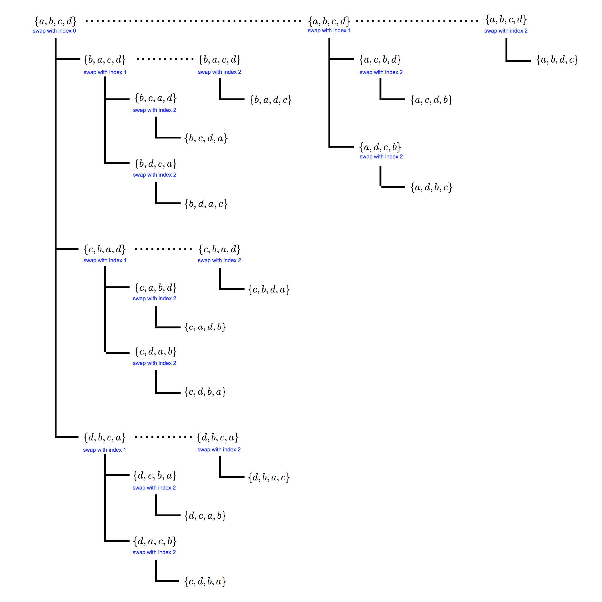
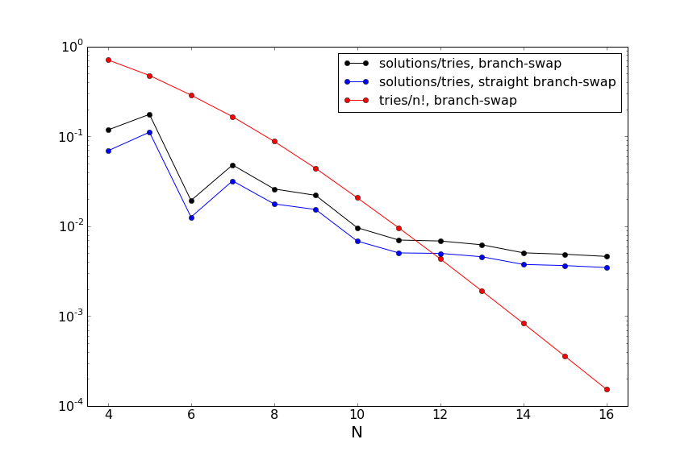

<!--
.. title: Permutations and the N Queens Problem
.. slug: permutations-and-the-n-queens-problem
.. date: 2015-08-12 15:29:14 UTC-07:00
.. tags: mathjax, permutations, combinatorics, chess, python, recursion, c++
.. category:
.. link:
.. description:
.. type: text
-->

I ran across an interesting problem recently while studying some recursive algorithms: the N Queens Problem.  Given an $N$-by-$N$ chessboard, the problem is to determine the number of configurations of $N$ queens on the chessboard that do not attack each other.  That is, for a valid configuration (solution) no two queens share the same row (rank), column (file), or diagonal.

For $N = 1$ there is a trivial solution, but none exist for $N = 2$ or $3$.  $N = 4$ has two solutions:

<div> $$
\begin{matrix}
- & Q & - & - \\\
- & - & - & Q \\\
Q & - & - & - \\\
- & - & Q & -
\end{matrix}
\qquad \text{ and } \qquad
\begin{matrix}
- & - & Q & - \\\
Q & - & - & - \\\
- & - & - & Q \\\
- & Q & - & -
\end{matrix}
$$ </div>
<br>

And they grow quickly from there.  For $N = 8$ there are $92$ solutions (many related by symmetry) -- here's one:

<div> $$
\begin{matrix}
- & - & Q & - & - & - & - & - \\\
- & - & - & - & - & Q & - & - \\\
- & - & - & - & - & - & - & Q \\\
Q & - & - & - & - & - & - & - \\\
- & - & - & Q & - & - & - & - \\\
- & - & - & - & - & - & Q & - \\\
- & - & - & - & Q & - & - & - \\\
- & Q & - & - & - & - & - & -
\end{matrix}
$$ </div>
<br>

and for $N = 15$ there are $2279184$ solutions.  It appears the number of solutions has not been computed for more than $N = 26$, where there are more than $22$ quadrillion solutions!  No general formula for the number solutions is known, nor is the asymptotic behavior.

<!-- TEASER_END -->

Even though the problem isn't well understood analytically, it's fairly straightforward to design an algorithm to compute the number of solutions.  A recursive algorithm naturally comes to mind, and one may even think a dynamic programming algorithm on $N$ would be useful.  However, by considering the simplest nontrivial cases, you can see that dynamic programming doesn't really work: only certain solutions for the $N-1$ case naturally extend to solutions for the $N$ case.

A brute force algorithm goes as follows:

   * Generate all possible permutations of $1, \ldots, N$.  Set a counter to $0$.
   * For each permutation $\{\pi_1, \ldots, \pi_N\}$, place a queen on row $i$ and column $\pi_i$, for $i = 1, \ldots, N$.
   * Test if this configuration is valid; if so, increment the counter.

We have set up this algorithm so that by default no queen is on the same row or column as another queen.  This means that in step 3 we only need to check the diagonals.  This algorithm will find all solutions but is extremely inefficient.  For $N = 8$ there are $8! = 40320$ possibilities to try but only $92$ solutions; for $N = 12$ there are $12! = 479001600$ possibilities but only $14200$ solutions!  We can do better -- the brute force algorithm ends up trying lots of solutions that don't work for the same reason (e.g. the queens on the first two rows are on the same diagonal).

The standard approach is a _backtracking algorithm_: one starts laying down queens on the chessboard (say row-by-row) in some systematic way that would cover all $N!$ configurations.  Once a queen is placed on a given row that invalidates the configuration, it is moved along that row until the solution becomes valid.  By repeatedly doing this, one can construct all possible solutions.  This algorithm is much more efficient than the brute force algorithm, since one avoids lots of invalid solutions quickly.  As far as I know there is no constructive solution to the problem -- no way to only generate solutions directly without using an iterative procedure that sometimes encounters invalid configurations.

I will describe an algorithm here that uses a slick permutation generator to solve the $N$ queens problem.  It is also non-constructive, but it appears more efficient than the backtracking algorithm.  First, let's talk about permutations!

# <span style="color:blue">Permutations</span>

Permutations are easy: they're easy to write down and can be generated recursively.  To generate the permutations of 3 elements,

<div> $$
\{1, 2, 3\} ,\, \{1, 3, 2\} ,\, \{2, 1, 3\} ,\, \{2, 3, 1\} ,\, \{3, 1, 2\} ,\, \{3, 2, 1\} \,,
$$ </div>
<br>

we start with permutations of two elements,

<div> $$
\{1, 2\} ,\, \{2, 1\} \,,
$$ </div>
<br>

and insert the third element at all possible positions in each permutation:

<div> $$
\begin{align}
\{1, 2\} \; &\to \; \{1, 2, 3\} ,\, \{1, 3, 2\} ,\, \{3, 1, 2\} \\\
\{2, 1\} \; &\to \; \{2, 1, 3\} ,\, \{2, 3, 1\} ,\, \{3, 2, 1\}
\end{align}
$$ </div>
<br>

We could loop like this to generate all possible permutations.  It's not clear how this relates to the $N$ queens problem if we want to do better than the brute force algorithm.

Here's another algorithm to generate permutations of $n$ objects.  I'll call it the _branch-swap algorithm_:

   * Start with a default ordering, e.g. $\pi_0 = \{1, 2, \ldots , n\}$.  Define a list $L$ to hold the permutations; add $\pi_0$.
   * Define a function $p_{\rm swap}$ taking as inputs an ordering $\pi = \{\pi_1, \ldots, \pi_n\}$, and index $i$, and the list of permutations $L$.  For each index $j > i$,
      * Generate an ordering $\pi_{i\leftrightarrow j}$ by swapping $\pi_i$ and $\pi_j$ in $\pi$.
      * Add $\pi_{i\leftrightarrow j}$ to $L$.
      * Call $p_{\rm swap}$ on $\pi_{i\leftrightarrow j}$ for all indices $k > i$.
   * Call $p_{\rm swap}$ on $\pi_0$ for all indices.

The index in $p_{\rm swap}$ tracks the point up to which we've swapped in elements to generate all possible permutations -- and that provides a nice advantage in cases where we'll want to throw out permutations as we generate them.

Here's a diagram of the algorithm for the case of 4 elements $\\{a, b, c, d\\}$:

<div style="text-align: center;"></div>
<br>

Each vertical line below a permutation is the call to $p_{\rm swap}$, and the horizontal lines from it (the branches) are the permutations generated.  The dotted horizontal lines are the recursive calls to $p_{\rm swap}$ with higher indices to swap from.

The feature of this algorithm is that each branch fixes a prefix of the set of objects: if we are calling $p_{\rm swap}$ on a permutation $\pi$ and we are swapping at index $i$, then _all_ subsequent permutations generated have the same values for indices up (but not including) $i$.  You can see this in the figure, and it would become much more evident in the case of 5 (or more) elements.

The sequence of permutations that comes out of the algorithm in this case is (reading top-to-bottom, then left-to-right):

<div> $$
\{a, b, c, d\} \qquad \qquad \{b, a, d, c\} \qquad \qquad \{c, b, d, a\} \qquad \qquad \{d, b, a, c\} \\\
\{b, a, c, d\} \qquad \qquad \{c, b, a, d\} \qquad \qquad \{d, b, c, a\} \qquad \qquad \{a, c, b, d\} \\\
\{b, c, a, d\} \qquad \qquad \{c, d, a, b\} \qquad \qquad \{d, c, a, b\} \qquad \qquad \{a, c, d, b\} \\\
\{b, c, d, a\} \qquad \qquad \{c, d, b, a\} \qquad \qquad \{d, c, b, a\} \qquad \qquad \{a, d, c, b\} \\\
\{b, d, c, a\} \qquad \qquad \{c, a, b, d\} \qquad \qquad \{d, a, c, b\} \qquad \qquad \{a, d, b, c\} \\\
\{b, d, a, c\} \qquad \qquad \{c, a, d, b\} \qquad \qquad \{d, a, b, c\} \qquad \qquad \{a, b, d, c\}
$$ </div>
<br>

Here's some `python` code for this algorithm:

```python
# generator for branch-swap permutation algorithm
def gen_branch_perms(base):
   yield base
   # recurse for all swap indices up to the next-to-last
   for i in range(len(base) - 1):
      for p in yield_branch(base, i):
         yield p

# branch-swap permutation algorithm, recursion generator
def yield_branch(perm, index):
   # create all single swaps of index with equal or greater indices
   for i in range(index + 1, len(perm)):
      perm_i = list(perm)
      perm_i[index], perm_i[i] = perm[i], perm[index]
      yield perm_i
      ## call the swap recursion with all greater indices, up to the 2nd to last
      for j in range(index+1, len(perm) - 1):
         for p in yield_branch(perm_i, j):
            yield p
```
<br>

The first generator performs the outer loop in the algorithm, while the second performs the recursion (second) step.  In `C++`, the corresponding functions look like:

```C++
// get the permutations of a string
vector<string> get_perms(vector<int> base) {
   // output container
   vector<vector<int> > perms;
   perms.push_back(base);

   // call the recursion
   for (size_t i = 0; i < base.size(); ++i) {
      permutation_step(perms, base, i);
   }

   return perms;
}

// recursion function
// works by swapping a given index with all others greater than it (separately)
void permutation_step(vector<vector<int> >& perms, vector<int> perm, int index) {
   // swap for all larger indices
   for (size_t i = index + 1; i < perm.size(); ++i) {
      vector<int> perm_i = perm;
      perm_i[index] = perm[i];
      perm_i[i] = perm[index];
      perms.push_back(perm_i);
      // call the permutation recursion again if we haven't reached the end of the list
      if (index < perm.size() - 1) {
         for (size_t j = index+1; j < perm_i.size(); ++j) {
            permutation_step(perms, perm_i, j);
         }
      }
   }
}
```
<br>

These return a vector of all permutations instead of an iterator.  In both implementations, it's useful to note that the permutations are added as the algorithm progresses.  When we enter a branch where we fix the first $i$ elements (via a swap), we add the permutation reached that point to the list of found permutations (or just yield it in the case of the python implementation).  Other permutations with the same first $i$ elements but different following elements are found through later swaps and added then.

### <span style="color:blue">Parsimony</span>

There's a slight modification of this algorithm which is slightly slower but is easier to conceptualize, more commonly known and used, and produces more concise code.  In the above version, once we make a swap to generate a permutation $\pi$ we will always interchange elements to create new permutations, and never perform what amounts to the identity operation on $\pi$.  The penalty for this is we have to have the secondary loop in the recursion function that creates branches of the algorithm where we swap at subsequently higher indices.  What if we eliminate this, and call the swap loop on a given index $i$ not from $i + 1$ up, but from $i$ up?  Well, we'll be performing the identity operation sometimes, and so we'll carry a permutation around as we push the index we're swapping out to the end of the list.  The `python` implementation of this version of the algorithm is

```python
# generator for straight branch-swap permtuation algorithm
def gen_straight_branch_perms(perm, index):
   # if we're at the last index, save and stop
   if index == len(perm) - 1:
      yield perm
   # create all single swaps of index with equal or greater indices
   for i in range(index, len(perm)):
      perm_i = list(perm)
      perm_i[index], perm_i[i] = perm[i], perm[index]
      ## call the swap recursion with the next index
      for perm_j in gen_straight_branch_perms(perm_i, index+1):
         yield perm_j
```
<br>

I'll give code using this version of the algorithm for the $N$ queens problem, but we'll see how the two versions compare.  I'll call this version the _straight branch-swap_ algorithm, because if you draw the equivalent diagram for this version to the figure above you get a vertical ordering.

# <span style="color:blue">The N Queens Problem</span>

Let's use the representation in the brute force algorithm above: a permutation $\pi_i = \{ \pi_1, \ldots, \pi_N\}$ is a board with queens at (row, column) positions $(1, \pi_1), (2, \pi_2), \ldots , (N, \pi_N)$.  For example, for $N = 4$, one of the solutions is represented:

<div> $$
\{ 3, 1, 4, 2 \} \; \leftrightarrow \; \begin{matrix}
- & - & Q & - \\\
Q & - & - & - \\\
- & - & - & Q \\\
- & Q & - & -
\end{matrix}
$$ </div>
<br>

So let's say we write down a permutation where laying down the $i^{\rm th}$ queen causes us to create an invalid configuration.  For example, if we have $N = 6$ queens and the first 3 queens are $1, 5,$ and $4$,

<div> $$
\{ 1, 5, 4, ?, ?, ? \} \; \leftrightarrow \; \begin{matrix}
Q & - & - & - & - & - \\\
- & - & - & - & Q & - \\\
- & - & - & Q & - & - \\\
- & ? & ? & - & - & ? \\\
- & ? & ? & - & - & ? \\\
- & ? & ? & - & - & ? \\\
\end{matrix}
$$ </div>
<br>

We know that we can throw out all permutations that start with this sequence -- we don't need to generate any more elements of the permutation!  We can save ourselves from generating the 6 possible permutations that start this way.  This is exactly what the branch-swap algorithm is doing: if at the $i^{\rm th}$ index we generate a permutation that will not give a valid solution, we can pull the emergency brake and not generate _any_ permutations with those first $i$ indices (other than the one we've already tested).  Formally, we terminate the given branch of the recursion.

Of course, the branch-swap permutation algorithm isn't the only one that has the property that it generates sequences of permutations this way.  For example, generating lexicographically-ordered permutations has this same property.  However, the branch-swap algorithm easily encodes the critical feature that it can bypass unwanted permutations by terminating the relevant branch of the recursion.

To tackle the $N$ queens problem, we need a way to check that a given queen is not attacking any others.  Actually, all we'll need is to check that it's not attacking any queen on a lower row, since we'll build a solution by recursively calling this check function as we go.  Here's the function:

```python
# function to determine if a given queen (with a given index)
# is not attacking any other queen with a lower index
def is_safe(perm, index):
   dL_index = perm[index] + index
   dR_index = perm[index] - index
   for i in range(index):
      dL_i = perm[i] + i
      dR_i = perm[i] - i
      if (dL_index == dL_i) or (dR_index == dR_i):
         return False
   # if we get here, there's no attacks
   return True
```
<br>

We use the fact that the left and right diagonals have either the same value of `row + column` or `row - column`.  We could do this comparison more pythonically:

```python
# function to determine if a given queen (with a given index)
# is not attacking any other queen with a lower index
def is_safe(perm, index):
   return (perm[index] + index not in [perm[i] + i for i in range(index)]) and (perm[index] - index not in [perm[i] - i for i in range(index)])
```
<br>

Then we just need to modify the permutation algorithm above to stop at a given branch when this function fails:

```python
# N queens problem
def nqueens(n):
   base = range(n)
   # counter for the number of solutions we try
   ntries = itertools.count()
   next(ntries)
   for p in explore(ntries, n, base, 0):
      yield p
   print next(ntries),"solutions tried"

# branch-swap permtuation algorithm, recursion function
# adapted for N queens problem
def explore(ntries, n, perm, index):
   # if we're at the last index, check the last row and end the branch
   if index == n - 1:
      if is_safe(perm, index):
         yield perm
      return
   # create all single swaps at index with equal or greater indices
   for i in range(index, n):
      perm_i = list(perm)
      perm_i[index], perm_i[i] = perm[i], perm[index]
      next(ntries)
      # check the diagonals for all smaller indices
      if is_safe(perm_i, index):
         # call the recursion with the next index
         for p in explore(ntries, n, perm_i, index+1):
            yield p
```
<br>

I've also added a counter for the number of solutions we try.  We can do the same using the original branch-swap algorithm described first, and compare.  It's also useful to compare to $n!$, the number of configurations we'd have to try in the brute force case.

I've coded up this algorithm in both `python` and `C++`, and you can find them on my [GitHub repo](https://github.com/jrwalsh1/Permutations "Permutations") for this project.  To get the solutions through $N = 16$, I used the `C++` version which runs in about 20 minutes on my laptop.  Scaling out, it would take about 2.5 hours for $N = 17$, and about 19 hours for $N = 18$!  I haven't tried to optimize the code, but the runtime is similar to the main [C++ solution on Rosetta Code](http://rosettacode.org/wiki/N-queens_problem#C.2B.2B "Rosetta C++ solution for N queens"), once you take into account the multithreading in that code.  A [Fortran 77 version on Rosetta Code](http://rosettacode.org/wiki/N-queens_problem#Alternate_Fortran_77_solution "Fortran solution on Rosetta Code") based on the same ideas is far faster, by at least an order of magnitude!  And `python` is about an order of mangitude slower than `C++`.

Here's a table of the number of solutions and tries for all 3 algorithms:
<br>

| N    | &nbsp;&nbsp; solutions | &nbsp;&nbsp; branch-swap tries | &nbsp;&nbsp; straight branch-swap tries | &nbsp;&nbsp; brute force tries |
| ------------- | ------------- |  ------------- | ------------- | ------------- |
| 4    |  &nbsp;&nbsp; 2         | &nbsp;&nbsp; 17        | &nbsp;&nbsp; 29        | &nbsp;&nbsp; 24         |
| 5    |  &nbsp;&nbsp; 10        | &nbsp;&nbsp; 57        | &nbsp;&nbsp; 90        | &nbsp;&nbsp; 120        |
| 6    |  &nbsp;&nbsp; 4         | &nbsp;&nbsp; 207       | &nbsp;&nbsp; 317       | &nbsp;&nbsp; 720       |
| 7    |  &nbsp;&nbsp; 40        | &nbsp;&nbsp; 833       | &nbsp;&nbsp; 1252      | &nbsp;&nbsp; 5040      |
| 8    |  &nbsp;&nbsp; 92        | &nbsp;&nbsp; 3543      | &nbsp;&nbsp; 5197      | &nbsp;&nbsp; 40320     |
| 9    |  &nbsp;&nbsp; 352       | &nbsp;&nbsp; 15969     | &nbsp;&nbsp; 22946     | &nbsp;&nbsp; 362880    |
| 10   |  &nbsp;&nbsp; 724       | &nbsp;&nbsp; 75189     | &nbsp;&nbsp; 105965    | &nbsp;&nbsp; 3628800   |
| 11   |  &nbsp;&nbsp; 2680      | &nbsp;&nbsp; 382111    | &nbsp;&nbsp; 531242    | &nbsp;&nbsp; 39916800  |
| 12   |  &nbsp;&nbsp; 14200     | &nbsp;&nbsp; 2073751   | &nbsp;&nbsp; 2847477   | &nbsp;&nbsp; 479001600 |
| 13   |  &nbsp;&nbsp; 73712     | &nbsp;&nbsp; 11868391  | &nbsp;&nbsp; 16119268  | &nbsp;&nbsp; 6227020800 |
| 14   |  &nbsp;&nbsp; 365596    | &nbsp;&nbsp; 72287547  | &nbsp;&nbsp; 97340005  | &nbsp;&nbsp; 87178291200 |
| 15   |  &nbsp;&nbsp; 2279184   | &nbsp;&nbsp; 467414973 | &nbsp;&nbsp; 624908454 | &nbsp;&nbsp; 1307674368000 |
| 16   |  &nbsp;&nbsp; 14772512   | &nbsp;&nbsp; 3204457467 | &nbsp;&nbsp; 4258873171 | &nbsp;&nbsp; 20922789888000 |

<br>
You can see that the number of tries for the branch-swap algorithms is far below the brute force case, as expected.  Furthermore, the branch-swap algorithm is more efficient than the straight branch-swap algorithm, although as $N$ increases the relative difference decreases.  Additionally, since the straight branch-swap algorithm is faster on a per-trial basis, the difference between the two algorithms is minimal.  The number of solutions is only a fraction of the number of tries, and this fraction is decreasing as $N$ increases: our algorithm is becoming less and less efficient at finding solutions.  Let's look at some of these efficiencies:

<div style="text-align: center;"></div>
<br>

First, you can see from the red line that we are getting more and more efficient at not trying bad solutions: the ratio of the number of tries to $n!$ (the number of tries in the brute force case) is exponentially falling.  This translates to a huge time savings in the code, even if the solution still scales exponentially.  The relatively efficiency of the branch-swap algorithms in finding actual solutions among the ones tried is going down, although the figure indicates this ratio _may_ be leveling off.  In the (unlikely) case where it did level off in the asymptotic limit, one could imagine trying to improve this ratio to move towards a constructive algorithm.  There's lots more to think about at this point, both in terms of code and algorithmic approaches! But for now I'll stop here.
